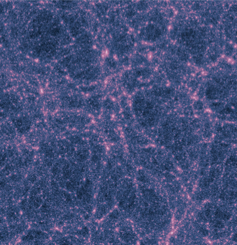

The parent simulation was setup primarily to find Milky Way-sized candidates at z = 0. All the parameters used for the construction of the simulation were oriented around this goal.

## Overview

  Volume   *h*^3 Mpc^3 | # particles | \\(m_{dm}\\)   10^7 *h*^-1 \\(M_\odot\\) | \\(m_{dm}\\)   10^7 \\(M_\odot\\) | \\(\epsilon_{dm}\\)   pc 
  :---: | :---: | :---: | :---: | :---: 
        100^3          | 1024^3 | 9 | 12 | 2441 

{{site.data.alerts.note}} The parent simulation initial conditions were run on an older version of MUSIC.{{site.data.alerts.end}}

## Volume

The volume of the parent simulation was selected to be 100 Mpc/h as this allows for roughly ~6500 Milky Way-sized (i.e. 10^12 Msol) systems to be found. After a gentle selection over local environment (i.e. making sure no halos were near clusters) 2122 candidates were used to select _Caterpillar_ candidates.

## Mass Resolution

We required a resolution which allowed us to resolve 10^12 Msol halos with 10,000 particles so as to construct well defined lagrangian volumes. This resulted in us selecting a resolution of 10243 or a particle mass of 8.72 x 107 \\(M_\odot/h\\).

## Halo Selection

We selected halos with the following environmental requirements:

* halos between 0.7 - 3 x 1012 \\(M_\odot\\) (6564 candidates)
* no halos larger than 7 x 1013 \\(M_\odot\\) within 7 Mpc
* no halos larger than 7 x 1012 \\(M_\odot\\) within 2.8 Mpc (2122 candidates)

This is roughly in line with Tollerud et al. (2012), Boylan-Kolchin et al. (2013), Fardal et al. (2013), Pfiffel et al. (2013), Li & White (2008), van der Marel et al. (2012), Karachentsev et al. (2004) and Tikhonov & Klypin (2009). This avoids Milky Way-sized systems near clusters but does not make them overly isolated necessarily. Halos were also selected to not be preferentially near the very edge of the simulation volume as a matter of convenience. The first 24 _Caterpillar_ halos are highlighted within the parent volume below.

## Temporal Resolution  

The time steps were set to be log of the expansion factor, following a similar convention to that used by the _Millenium_ and _Millenium-II_ simulations. The following table shows the various measures for time/size at each snapshot.

{{site.data.alerts.tip}} Be sure to use the halo utility module (haloutils) in Python for quickly getting the temporal quantity for a given snapshot. See data access for more information. {{site.data.alerts.end}}

<a href="data/parent_expansionlist.txt" class="btn btn-default " role="button"><i class="fa fa-github fa-lg"></i> Download CSV</a>

Snap | Scale Factor | Redshift | Time 
 :----: | :----: |  :----: |  :----:  
0 | 0.0213 | 46.0000 | 0.0535 
1 | 0.0290 | 33.5029 | 0.0851 
2 | 0.0367 | 26.2557 | 0.1212  
3 | 0.0444 | 21.5245 | 0.1613  
4 | 0.0521 | 18.1929 | 0.2051  
5 | 0.0598 | 15.7199 | 0.2522  
6 | 0.0675 | 13.8114 | 0.3025  
7 | 0.0752 | 12.2940 | 0.3557  
8 | 0.0829 | 11.0586 | 0.4117  
9 | 0.0906 | 10.0333 | 0.4704  
10 | 0.0983 | 9.1687 | 0.5316  
11 | 0.1060 | 8.4297 | 0.5952  
12 | 0.1138 | 7.7909 | 0.6612  
13 | 0.1215 | 7.2331 | 0.7294  
14 | 0.1292 | 6.7419 | 0.7998  
15 | 0.1369 | 6.3060 | 0.8723  
16 | 0.1446 | 5.9166 | 0.9469  
17 | 0.1523 | 5.5666 | 1.0234  
18 | 0.1600 | 5.2503 | 1.1018  
19 | 0.1677 | 4.9630 | 1.1821  
20 | 0.1754 | 4.7011 | 1.2642  
21 | 0.1831 | 4.4611 | 1.3481  
22 | 0.1908 | 4.2406 | 1.4337  
23 | 0.1985 | 4.0371 | 1.5210  
24 | 0.2062 | 3.8489 | 1.6098  
25 | 0.2139 | 3.6742 | 1.7003  
26 | 0.2216 | 3.5117 | 1.7923  
27 | 0.2294 | 3.3601 | 1.8858  
28 | 0.2371 | 3.2184 | 1.9808  
29 | 0.2448 | 3.0856 | 2.0772  
30 | 0.2525 | 2.9608 | 2.1749  
31 | 0.2602 | 2.8435 | 2.2741  
32 | 0.2679 | 2.7330 | 2.3745  
33 | 0.2756 | 2.6286 | 2.4762  
34 | 0.2833 | 2.5299 | 2.5792  
35 | 0.2910 | 2.4364 | 2.6834  
36 | 0.2987 | 2.3477 | 2.7888  
37 | 0.3064 | 2.2635 | 2.8953  
38 | 0.3141 | 2.1835 | 3.0029  
39 | 0.3218 | 2.1072 | 3.1116  
40 | 0.3295 | 2.0346 | 3.2213  
41 | 0.3372 | 1.9652 | 3.3321  
42 | 0.3449 | 1.8990 | 3.4438  
43 | 0.3527 | 1.8356 | 3.5565  
44 | 0.3604 | 1.7750 | 3.6701  
45 | 0.3681 | 1.7169 | 3.7846  
46 | 0.3758 | 1.6612 | 3.9000  
47 | 0.3835 | 1.6077 | 4.0161  
48 | 0.3912 | 1.5563 | 4.1331  
49 | 0.3989 | 1.5069 | 4.2508  
50 | 0.4066 | 1.4594 | 4.3693  
51 | 0.4143 | 1.4137 | 4.4884  
52 | 0.4220 | 1.3696 | 4.6082  
53 | 0.4297 | 1.3271 | 4.7287  
54 | 0.4374 | 1.2861 | 4.8497  
55 | 0.4451 | 1.2465 | 4.9714  
56 | 0.4528 | 1.2083 | 5.0936  
57 | 0.4605 | 1.1713 | 5.2163  
58 | 0.4683 | 1.1356 | 5.3395  
59 | 0.4760 | 1.1010 | 5.4632  
60 | 0.4837 | 1.0675 | 5.5873  
61 | 0.4914 | 1.0351 | 5.7118  
62 | 0.4991 | 1.0037 | 5.8367  
63 | 0.5068 | 0.9732 | 5.9620  
64 | 0.5145 | 0.9437 | 6.0876  
65 | 0.5222 | 0.9150 | 6.2135  
66 | 0.5299 | 0.8871 | 6.3396  
67 | 0.5376 | 0.8601 | 6.4660  
68 | 0.5453 | 0.8338 | 6.5927  
69 | 0.5530 | 0.8082 | 6.7195  
70 | 0.5607 | 0.7834 | 6.8465  
71 | 0.5684 | 0.7592 | 6.9737  
72 | 0.5761 | 0.7357 | 7.1010  
73 | 0.5838 | 0.7128 | 7.2284  
74 | 0.5916 | 0.6905 | 7.3559  
75 | 0.5993 | 0.6687 | 7.4835  
76 | 0.6070 | 0.6475 | 7.6111  
77 | 0.6147 | 0.6269 | 7.7387  
78 | 0.6224 | 0.6067 | 7.8663  
79 | 0.6301 | 0.5871 | 7.9939  
80 | 0.6378 | 0.5679 | 8.1215  
81 | 0.6455 | 0.5492 | 8.2490  
82 | 0.6532 | 0.5309 | 8.3764  
83 | 0.6609 | 0.5131 | 8.5038  
84 | 0.6686 | 0.4956 | 8.6310  
85 | 0.6763 | 0.4786 | 8.7581  
86 | 0.6840 | 0.4619 | 8.8851  
87 | 0.6917 | 0.4456 | 9.0119  
88 | 0.6994 | 0.4297 | 9.1385  
89 | 0.7072 | 0.4141 | 9.2649  
90 | 0.7149 | 0.3989 | 9.3912  
91 | 0.7226 | 0.3840 | 9.5172  
92 | 0.7303 | 0.3694 | 9.6430  
93 | 0.7380 | 0.3551 | 9.7685  
94 | 0.7457 | 0.3410 | 9.8938  
95 | 0.7534 | 0.3273 | 10.0188  
96 | 0.7611 | 0.3139 | 10.1436  
97 | 0.7688 | 0.3007 | 10.2680  
98 | 0.7765 | 0.2878 | 10.3922  
99 | 0.7842 | 0.2752 | 10.5160  
100 | 0.7919 | 0.2627 | 10.6395  
101 | 0.7996 | 0.2506 | 10.7627  
102 | 0.8073 | 0.2386 | 10.8855  
103 | 0.8150 | 0.2269 | 11.0081  
104 | 0.8228 | 0.2154 | 11.1302  
105 | 0.8305 | 0.2042 | 11.2520  
106 | 0.8382 | 0.1931 | 11.3734  
107 | 0.8459 | 0.1822 | 11.4944  
108 | 0.8536 | 0.1715 | 11.6151  
109 | 0.8613 | 0.1611 | 11.7354  
110 | 0.8690 | 0.1508 | 11.8552  
111 | 0.8767 | 0.1406 | 11.9747  
112 | 0.8844 | 0.1307 | 12.0938  
113 | 0.8921 | 0.1209 | 12.2124  
114 | 0.8998 | 0.1113 | 12.3307  
115 | 0.9075 | 0.1019 | 12.4485  
116 | 0.9152 | 0.0926 | 12.5659  
117 | 0.9229 | 0.0835 | 12.6828  
118 | 0.9306 | 0.0745 | 12.7994  
119 | 0.9383 | 0.0657 | 12.9155  
120 | 0.9461 | 0.0570 | 13.0311  
121 | 0.9538 | 0.0485 | 13.1464  
122 | 0.9615 | 0.0401 | 13.2611  
123 | 0.9692 | 0.0318 | 13.3755  
124 | 0.9769 | 0.0237 | 13.4894  
125 | 0.9846 | 0.0157 | 13.6028  
126 | 0.9923 | 0.0078 | 13.7158  
127 | 1.0000 | 0.0000 | 13.8283  

