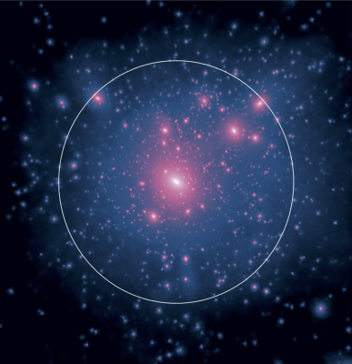
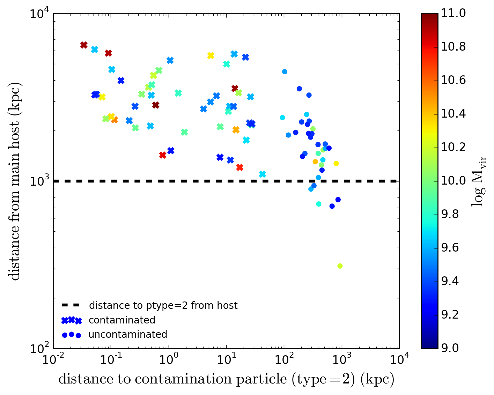
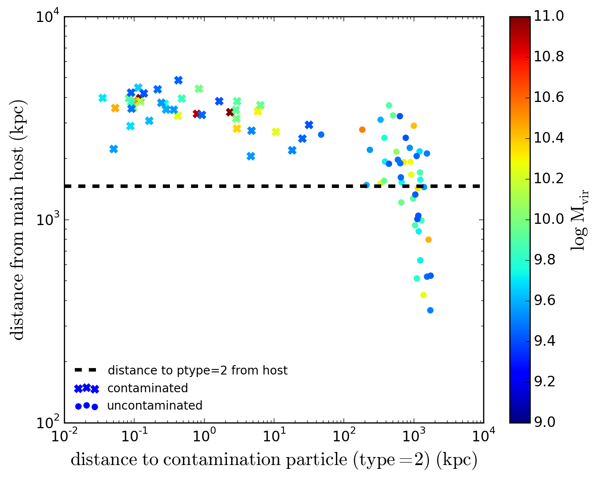

The majority of the information about the zoom-in runs can be found in [Griffen et al. (2016)](http://adsabs.harvard.edu/cgi-bin/bib_query?arXiv:1509.01255). Here we simply outline some details which were left out of the publication for the sake of brevity.

## Overview

~*Aquarius*   Level | MUSIC   *levelmax* | Effective   Resolution | \\(m_{dm}\\)   10^4 *h*^-1 \\(M_\odot\\) | \\(m_{dm}\\)   10^4 \\(M_\odot\\) | \\(\epsilon_{dm}\\)   pc 
  :---: | :---: | :---: | :---: | :---: | :---: 
1 | 15 | 32768^3 | 0.25 | 0.37 | 36
**2** | **14** | **16384^3** | **2** | **3** | **76**
3 | 13 | 8096^3 | 16 | 24 | 152
4 | 12 | 4096^3 | 128 | 190 | 228
5 | 11 | 2048^3 | 1025 | 1527 | 452

Each panel represents one single realization of the Cat-1 halo at different resolutions. The far left is an LX11 run and the far right is an LX14 run.

{{site.data.alerts.note}} The LX15 run has currently only been run for one of the halos and has been temporarily paused at z = 1. This will be finished with a few others once the main suite has been completed.{{site.data.alerts.end}}

We have complete (modified) rockstar halo catalogues (together with consistent-trees merger trees) and z = 0 subfind catalogues.

## Force Softening

Softening was 1/80th the interparticle separation. We adopt the formula: `boxwidth/lx^2/80` but stagger the force softenings for each higher level as 4xbase, 8xbase, 32xbase, 64xbase where base is the base force softening. For each of the zooms, this equates to:

In Gadget | LX11 | LX12 | LX13 | LX14
 :---: | :---: | :---: | :---: | :---: 
`SofteningHal`o | 0.000610352	| 0.000305176	| 0.000152588	| 7.62939E-05
`SofteningDisk` | 0.002441406	| 0.001220703	| 0.000610352	| 0.000305176
`SofteningBulge` | 0.004882813	| 0.002441406	| 0.001220703	| 0.000610352
`SofteningStars` | 0.01953125	| 0.009765625 |	0.004882813	| 0.002441406
`SofteningBndry` | 0.0390625	  | 0.01953125	  | 0.009765625	| 0.004882813

## Temporal Resolution

{{site.data.alerts.warning}} Timesteps are spaced logarithmically in expansion factor to z = 6, then linearly spaced in expansion factor down to z = 0. Always be aware of this as it could be strength and a weakness of your study.{{site.data.alerts.end}}

This image shows the difference between the time step resolutions used in Caterpillar and those used in the Aquarius simulation. We wanted higher resolution at all redshifts for many purposes. At z > 6 we wanted to model Lyman-Werner radiation which requires timesteps of order the lifespan of Population III star formation. At low redshift we wanted timesteps of roughly 50-60 Myrs which is the disruption time scale of many small dwarf galaxies of the Milky Way. This also allows detailed modelling of the pericentric passages of infalling satellite systems, which is a crucial parameter for determining post-infall mass loss, for example.

## Contamination Study

A number of contamination studies have been carried out. This involves changing the Lagrangian geometry in some way to keep the contamination (distance to the nearest particle type 2 as far as possible) low whilst conserving CPU hours. Our selected test geometries were as follows

|  Geometry           | Detail  |
:---: | ---
BA | Original MUSIC bounding box (e.g. the exact bounding box of lagr volume).
BB | 1.2 bounding box extent
BC | 1.4 bounding box extent
BD | 1.6 bounding box extent
CA | Convex Hull Volume
EA | Original MUSIC ellipsoid (e.g. the exact bounding box of lagr volume).
EB | 1.1 padding
EC | 1.2 padding
EX | 1.05 padding

We did this for both 4 and 5 times the virial radius at z = 0 (marked by the letter 4 or 5 at the end of the abbreviated geometry). Making a total of ~18 test halos per _Caterpillar_ halo. Our requirement was that there was no contamation (particle type 2) within 1 Mpc of the host at the LX11 level.

We also looked at how the geometry of the lagrangian volume affected the contamination radius. As outlined in Griffen et al. (2015), we did not find any correlation with geometry and overall level contamination. Every simulation requires its own tailored geometry to achieve our contamination requirements.

The size of the lagrangian volumes were also another challenge to overcome. If a halo had LX11 ICs which were larger than 300mb, we found that we could not run these at LX14 on national facilities. The size and distance became our two biggest obstacles when running the _Caterpillar_ suite.

Our rockstar catalogues only use the high-resolution particles. This means that there will be halos in the outskirts of the simulation which are contaminated. These are shown clearly below. Be sure not to just take all halos within the rockstar catalogues as some of them will be contaminated (underestimated masses, wrong profiles etc.). As a safety, one should only take halos which are within the contamination distance. This changes as a function of redshift so make sure you update your cut for each snapshot. The plots below are for z = 0.

